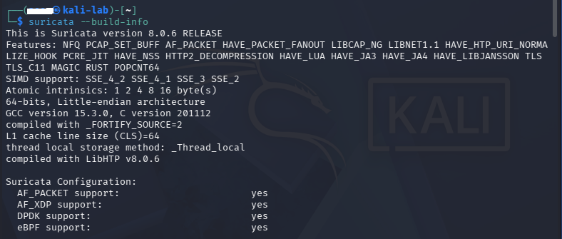
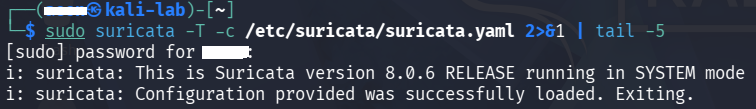
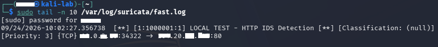
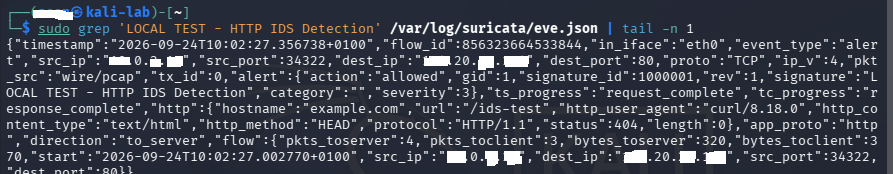
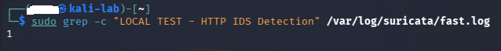
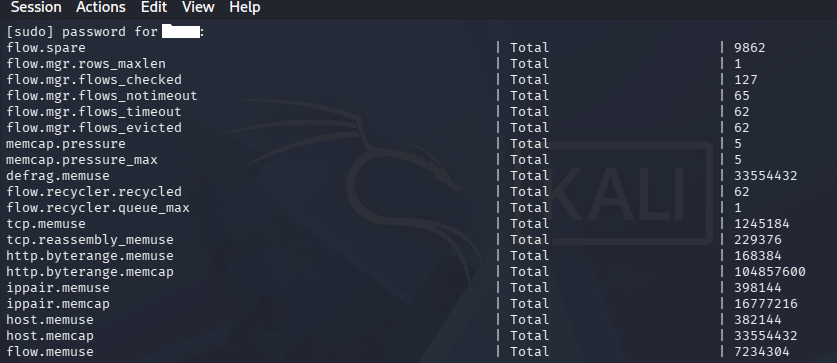
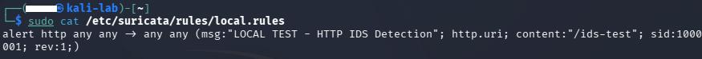

# Network IDS with Suricata

A hands-on Network Intrusion Detection System (IDS) lab using Suricata on Kali Linux.

## Overview

This project demonstrates the deployment and testing of a Network Intrusion Detection System (IDS) using Suricata on Kali Linux. The lab covers Suricata configuration, rule management, custom HTTP detection, alert generation, structured event logging, and validation through controlled network traffic.

## Objectives

- Deploy Suricata as a network intrusion detection system (IDS)
- Configure Suricata for network traffic monitoring
- Load and validate Suricata detection rules
- Create and test a custom HTTP detection rule
- Analyze IDS alerts and structured security events
- Perform positive and negative detection testing

## Environment

- OS: Kali Linux
- Suricata: 8.0.6
- Network Interface: eth0
- Deployment: Virtual Machine (Kali Linux)

## Architecture

``` text
Network Traffic
       |
       v
      eth0
       |
       v
   Suricata IDS
       |
       v
Detection Engine
       ^
       |
Detection Rules
       |
       +------------------+
       |                  |
       v                  v
   fast.log           eve.json
       |                  |
       +--------+---------+
                |
                v
          Alert Analysis
```

## Lab Setup

- Installed and verified Suricata on Kali Linux
- Validated the Suricata configuration successfully
- Loaded and verified Suricata detection rules
- Created and tested a custom HTTP detection rule
- Analyzed IDS alerts using `fast.log` and `eve.json`
- Performed positive and negative detection tests

## Detection Workflow

- Network traffic is captured from the `eth0` interface
- Suricata inspects the captured traffic using its detection engine
- The detection engine evaluates the traffic against the loaded Suricata rules
- When traffic matches a detection rule, Suricata generates an alert
- Alerts and event data are recorded in `fast.log` and `eve.json` for analysis

## Custom Detection Rule

A local Suricata rule was created to detect HTTP requests containing the `/ids-test` URI.

```text
alert http any any -> any any (msg:"LOCAL TEST - HTTP IDS Detection"; http.uri; content:"/ids-test"; sid:1000001; rev:1;)
```

This rule generates an alert when an HTTP request contains `/ids-test` in the request URI.

- `http.uri` inspects the HTTP request URI.
- `content:"/ids-test"` searches for the `/ids-test` string.
- `sid:1000001` uniquely identifies the local rule.

The rule was tested with a controlled HTTP request to `/ids-test`, which generated a Suricata alert.

## Alert Evidence

- `fast.log` captured the generated IDS alert.
- `eve.json` recorded the same alert as a structured JSON event.
- The alert was analyzed to verify the source, destination, protocol, signature, and HTTP request details.
- A negative test using a normal HTTP request did not trigger the custom rule.

## Evidence

**Suricata Version**



**Suricata Configuration Test**



**Suricata Rules Loaded**


**Custom Rule Detection**



**EVE JSON Alert**



**Custom Rule Negative Test**



**Structured Alert Analysis**

[Structured Alert Analysis](evidence/07-structured-alert-analysis.txt)

**Suricata Statistics**



**Custom Detection Rule**

## Key Findings

- Suricata successfully monitored network traffic through the `eth0` interface.
- The Suricata configuration was validated successfully before deployment.
- Suricata loaded and processed the configured detection rules.
- A custom HTTP rule was created to detect requests containing `/ids-test`.
- The custom rule successfully generated an IDS alert when matching traffic was detected.
- The alert was recorded in both `fast.log` and `eve.json`.
- The structured `eve.json` event provided detailed information about the detected traffic, including source, destination, protocol, signature, and HTTP request details.
- A negative test using a normal HTTP request did not trigger the custom detection rule, demonstrating that the rule matched the intended URI.
- Suricata statistics confirmed that network traffic was being captured and processed by the IDS.

## Lessons Learned

- Suricata provides both concise alert logging and detailed structured event data.
- Custom detection rules can be used to identify specific network activity relevant to a security monitoring objective.
- Validating the configuration and loaded rules before testing helps ensure reliable detection.
- Positive and negative testing are important for confirming that detection rules behave as intended.
- `eve.json` provides useful context for investigating and analyzing detected network activity.
- IDS alerts are detection events; Suricata does not automatically block the traffic unless additional prevention controls are configured.

## Conclusion

This lab demonstrated the deployment and validation of Suricata as a Network Intrusion Detection System. Controlled HTTP traffic was successfully detected using a custom rule, with alerts recorded in both `fast.log` and `eve.json`. The lab also demonstrated structured alert analysis and positive and negative detection testing.
